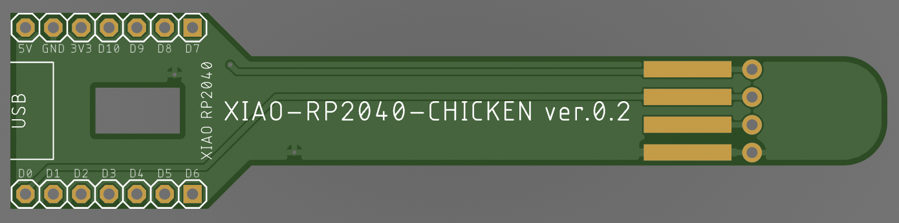

# xiao-rp2040-chicken

A crazy midi controller make with Seeed Studio's [XIAO RP2040](https://www.seeedstudio.com/XIAO-RP2040-v1-0-p-5026.html)  and showting chicken!

### schematics

### parts list

- [XIAO RP2040](https://www.seeedstudio.com/XIAO-RP2040-v1-0-p-5026.html) x 1
- [Mic board](https://akizukidenshi.com/catalog/g/gM-08940/) x 1
- [Vibration sensor](https://akizukidenshi.com/catalog/g/gP-15375/) x 1
- 2.54mm pitch lowprofile pinheader (1x7) x 2
- 2.54mm pitch lowprofile pinsocket (1x7) x 2
- 0805 10kΩ resistor x 1
- 2.54mm pitch L-angle pinsocket (1x4) x 1

### License

MIT

